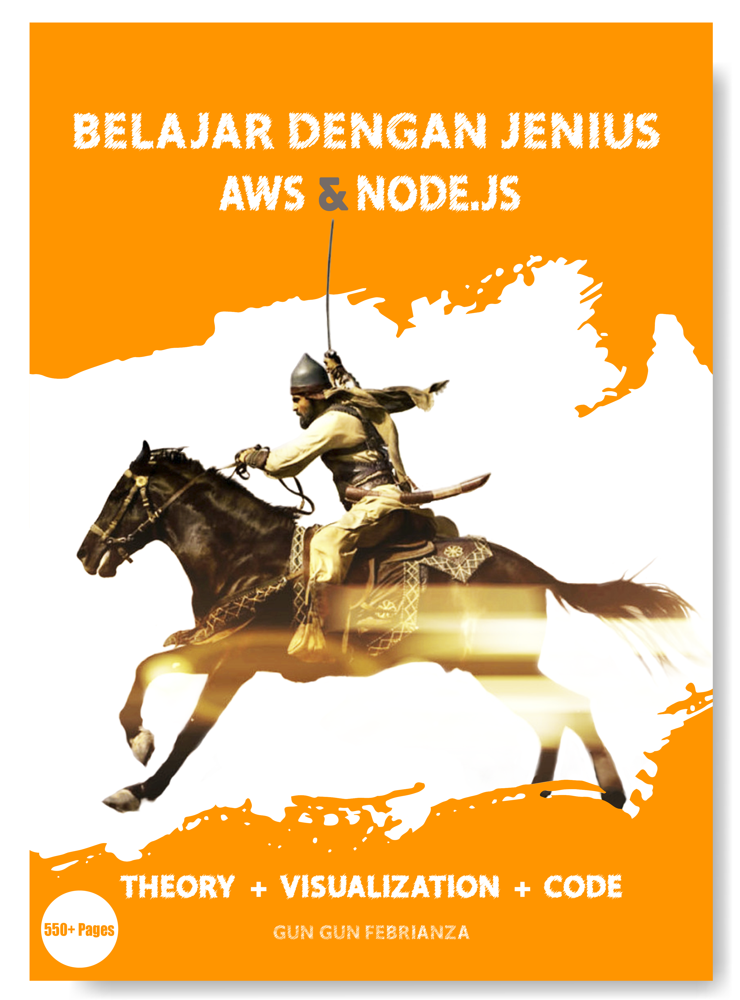

# Belajar Dengan Jenius Amazon Web Service & Node.js
Author : Gun Gun Febrianza

## Table of Contents
## Open Library Indonesia
Metode Belajar
Learning Problems & Abstraction Control
* ### Matthew Effect in Reading
  * ### Persiapan
  * ###  Apa saja yang harus dipersiapkan?	
    * Install Node.js	
    * Install Visual Studio Code	
    * Install Google Chrome atau Firefox.	
    * Install git
    * Install Postman
  * ### Konvensi Penulisan?
  * ### Feedback?
  * ### Kode Sumber?
  * ### Penggunaan Kode ?
  * ### Terdapat Kesalahan?
  * ### Pertanyaan, Kritik dan Saran?
***
* ### Chapter 1
* ### Belajar Open Web Platform
***
* ### Subchapter 1 – Apa itu Open Web Platform
  * #### Technical Specification
  * #### HTML 5.2
    * 1.  Semantic Advantage
    * 2.  Connectivity Advantage
    * 3. Storage Advantage
    * 4. Multimedia Advantage
    * 5. Performance Advantage
    * 6. Device Access Advantage
    * 7. Specification
  * ### Web Assembly
    * 1. Safe
    * 2. Fast
    * 3. Portable Code
    * 4. Compact Code
    * 5. Specification
  * ### EcmaScript
    * 1. Specification
  * ### Web Socket
    * 1. Specification
    * 2. Application
  * ### WebRTC
    * 1. Specification
    * 2. Application
  * ### WebGL
    * Specification
    * Application
  ***
* ### Subchapter 2 – Apa itu Web Application?
  * ### Server
    * 1. File Server
    * 2. Mail Server
    * 3. Proxy Server
    * 4. Application Server
    * 5. Database Server
    * 6. Messaging Server
  * ### Virtual Private Server
    * 1. Virtualization
    * 2. Virtual Machine
    * 3. Hypervisor
  * ### Web Server
  * ### Web Page
    * 1. Static Web Page
    * 2. Dynamic Web Page
    * 3. Progressive Web Application (PWA)
    * 4. Single Page Application (SPA)
  * ### Network
    * 1. Local Area Network (LAN)
    * 2. Wide Area Network (WAN)
    * 3. Internet Service Provide (ISP)
  * ### Internet
    * 1. Internet Transit
    * 2. Satellite & Fiber Optic
  * ### Internet Exchange Point
  * ### Content Delivery Network (CDN)
  * ### Cloud Computing
    * 1. Cloud Computing Execution Model
    * 2. Cloud Service Provider
    * 3. Scalability
    * 4. Load Balancer
  * ### Serverless Computing
    * 1. FaaS Provider
    * 2. AWS Lambda
   ***
* ### Subchapter 3 – Bedah Konsep HTTP	
  * ### HTTP & URL	
    * 1. HTTP	
    * 2. Hypertext & Hyperlink	
    * 3. Hypermedia	
    * 4. World Wide Web (www)	
    * 5. Uniform Resources Identifier (URI)	
    * 6. URL / Web Resources	
  * ### HTTP & DNS	
    * 1. IP Address	
    * 2. DNS Resolver	
    * 3. Root Server & TLD Server	
  * ### HTTP Transaction	
    * 1. TCP Thee-way Handshake	
  * ### HTTP Request	
    * 1. HTTP Method	
    * 2. Message	
    * 3. HTTP Header	
    * 4. Header Attribute	
    * 5. MIME	
  * ### HTTP Response	
  * ### HTTP Status Message	
  ***
* ### Subchapter 4 – Web Security	
  * ### Data in The Low Level	
    * 1. Host	
    * 2. Socket	
    * 3. Bit	
    * 4. Byte	
    * 5. Bytes	
    * 6. Character	
    * 7. ASCII	
    * 8. Data Transmission	
    * 9. Base64 Encoding	
  * ### Cryptography	
    * 1. Cryptanalysis	
    * 2. Information Security	
    * 3. Ciphertext	
    * 4. Symmetric Cryptography	
    * 5. Hash Function	
    * 6. Message Authentication Codes (MAC)	
    * 7. Assymetric Cryptography	
    * 8. Cryptography Protocol	
  * ### Man In The Middle (MITM) Attack	
    * 1. Eavesdropping	
  * ### HTTPS	
    * 1. Perbedaan HTTP & HTTPS	
    * 2. Manfaat HTTPS	
  * ### Secure Socket Layer (SSL)	
    * 1. Transport Socket Layer (TLS)	
    * 2. SSL Handshake	
***
* ### Chapter 2
* ### Setup Learning Environment
***
* ### Subchapter 1 – Visual Studio Code	
  * ### Install Programming Language Support	
  * ### Install Keybinding	
  * ### Install & Change Theme Editor	
  * ### The File Explorer	
  * ### Search Feature	
  * ### Source Control	
  * ### Debugger	
  * ### Extension	
    * 1. Auto Fold	
    * 2. Better Comment	
    * 3. Bookmarks	
    * 4. Javascript (ES6) Code Snippets	
    * 5. Path Intellisense
    * 6. VSCode Great Icons
  * ### The Terminal
    * 1. Menambah Terminal Baru
    * 2. Melakukan Split Terminal
    * 3. Mengubah Posisi Terminal	
    * 4. Menghapus Terminal	
  * ### Performance Optimization	
  * ### Zen Mode	
  * ### Display Multiple File	
  * ### Font Ligature	
  ***
* ### Subchapter 2 – Web Browser
  * ### Web Browser	
  * ### WebConsole	
    * 1. Autocomplete	
    * 2. Syntax Highlighting	
    * 3. Execution History	
  * ### Multiline Code Editor	
  ***
* ### Subchapter 3 – Javascript REPL	
  * ### Node.js	
    * 1. Apa itu REPL?	
    * 2. Apa itu Shell?	
    * 3. Node Virtual Machine	
   * ### JSBin	
  ***
* ### Chapter 3	
* ### Mastering Javascript	
***
* ### Subchapter 1 – Introduction to Javascript	
  * ### Hello World	
  * ### Comment	
  * ### Expression & Operator	
    * 1. Statement	
    * 2. Expression	
    * 3. Operator & Operand	
    * 4. Operator Precedence	
    * 5. Arithmetic Operator	
    * 6. Arithmetic Operation	
    * 7. Comparison Operator	
    * 8. Logical Operator	
    * 9. Assignment Operator	
  * ### Javascript Strict Mode	
    * 1. Legacy Code	
  * ### Automatic Add Semicolon	
  * ### Variable Declaration	
    * 1. Variable	
    * 2. Binding	
    * 3. Reserved Words	
    * 4. Naming Convention	
    * 5. Case Sensitivity	
    * 6. Loosely Typed Language	
    * 7. Var Keyword	
    * 8. Let Keyword	
    * 9. Constant Keyword	
  * ### Clean Code Variable Declaration	
    * 1. Avoid Global Variable	
    * 2. Declaration on Top	
    * 3. Initialize Variable	
    * 4. Use Const or Let	
***
* ### Subchapter 2 – Data Types	
  * ### Javascript Data Types	
    * 1. Apa itu Data?	
    * 2. Apa itu Types?	
    * 3. Apa itu Generic Variable?	
    * 4. Javascript Data Types	
    * 5. Apa itu Pointer?	
    * 6. Apa itu Stack & Heap?	
    * 7. Apa itu Primitive & Reference Values?	
    * 8. Primitive Types	
    * 9. Reference Types	
    * 10. Primitive as Object via Object Wrapper	
  * ### Data Types Conversion	
    * 1. Dynamic Typed	
    * 2. String To Number	
    * 3. String To Decimal Number	
    * 4. Number to String	
    * 5. Decimal Number to String	
    * 6. Boolean to String	
    * 7. Check Data Type	
  * ### Number Data Types	
    * 1. Infinity	
    * 2. NaN	
    * 3. Maximum & Minimum Value	
    * 4. Max Safe Integer	
    * 5. Safe Integer Checking
    * 6. Positive e Notation	
    * 7. Negative e Notation	
    * 8. Rounding	
    * 9. Precision	
    * 10. Exponentiation	
    * 11. e Notation Trigger	
    * 12. Number Accuration	
    * 13. Imprecise Calculation	
    * 14. Solution to Imprecise	
    * 15. Fixed Number	
    * 16. Numeric Conversion	
    * 17. Math Object	
    * 18. Hexadecimal, Binary dan Octadecimal	
  * ### String Data Types	
    * 1. Double Quote String	
    * 2. Single Quote String	
    * 3. String Concatenation	
    * 4. Numeric String Characteristic	
    * 5. Escaping	
    * 6. Template String	
    * 7. String Objects & Primitives	
    * 8. String Function	
  * ### Booleans Data Types
  * ### Null Data Types
  * ### Undefined Data Types	
  * ### Symbol Data Types	
  * ### BigInt Data Types	
    * 1. Arbitrary Precision	
    * 2. Arithmetic Operation	
    * 3. Comparison	
  * ### Clean Code Data Types	
    * 1. Declare Primitive Not Object	
    * 2. Stop using new Keyword	
***
* ### Subchapter 3 – Control Flow	
  * ### Block Statements	
  * ### Conditional Statements	
  * ### Ternary Operator	
  * ### Multiconditional Statement	
  * ### Switch Style	
  ***
* ### Subchapter 4 – Loop & Iteration	
  * ### While Statement	
  * ### Do … While Statement	
  * ### For Statement	
  * ### Break Statement	
  * ### Continue Statement	
  * ### Labeled Statement	
  ***
* ### Subchapter 5 – Function	
  * ### Apa itu Function?	
    * 1. Function Declaration	
    * 2. Function Expression	
    * 3. Arrow Function Expression	
  * ### First-class Function	
    * 1. What is Execution Context (EC)?	
  * ### Simple Function	
  * ### Function Parameter	
  * ### Function Return	
  * ### Function For Function Parameter	
  * ### Function & Local Variable	
  * ### Function & Outer Variable	
  * ### Callback Function	
  * ### Arrow Function	
  * ### Multiline Arrow Function	
  * ### Anonymous Function	
  * ### Function Constructor	
  * ### Function As Expression	
  * ### Nested Function	
  * ### Argument Object	
  * ### This Keyword	
    * 1. Implicit Binding	
  * ### Call & Apply Function	
    * 1. Explicit Binding	
    * 2. Call	
    * 3. Apply	
  * ### IIFE	
  * ### Clean Code Function	
    * 1. Always Declare Local Variable	
    * 2. Use Named Function Expression	
    * 3. Use Default Parameter	
    * 4. Function is not statement
***
* ### Subchapter 6 – Error Handling	
  * ### Syntax Error	
    * 1. Missing Syntax	
    * 2. Invalid Syntax	
  * ### Logical Error	
  * ### Runtime Error	
    * 1. Referrence Error	
    * 2. Range Error	
    * 3. Type Error	
    * 4. Syntax Error	
  * ### Try & Catch	
    * 1. Error Object Properties	
    * 2. Stack Trace	
    * 3. Finnaly	
  * ### Custom Error	
***
* ### Subchapter 7 – Object	
  * ### Apa itu Fundamental Objects?	
  * ### Custom Object	
    * 1. Object Initializer	
    * 2. Object Property	
    * 3. Object Method	
    * 4. Object Constructor	
    * 5. Function Constructor	
    * 6. Object Prototype	
    * 7. Getter & Setter	
    * 8. Object Destructure	
  * ### Custom Object Property	
    * 1. Add Object Property	
    * 2. Access Object Property	
    * 3. Delete Object Property	
    * 4. Check Object Property	
  * ### Custom Object Method	
    * 1. Access Object Method	
    * 2. Add Object Method	
  * ### Custom Object Looping	
  * ### JSON	
    * 1. JSON & Object Literal	
    * 2. Stringify	
    * 3. Parse JSON	
    * 4. Parse Date in JSON	
***
* ### Subchapter 8 – Classes	
  * ### Class-based language	
  * ### Class Declaration	
    * 1. Strict Mode	
    * 2. Constructor	
    * 3. Static Method	
    * 4. Getter & Setter	
  * ### Class Expression	
    * 1. Unnamed Class	
    * 2. Named Class	
  * ### Class Inheritance	
    * 1. Method Override	
    * 2. Constructor Override	
***
* ### Subchapter 9 – Collection	
  * ### Apa itu Collection?	
    * 1. Iterable	
    * 2. Keyed	
    * 3. Destructurable	
  * ### Apa itu Indexed Collections?	
    * 1. Array	
    * 2. Create Array	
          * Index & Element
          * Array Constructor
          * Array Literal
          * Access Aray Element
          * Modify Array Element
          * Array Destructuring (ES6)
          * Array Looping
          * Array Looping (ES6)
          * Array Iterator Object
          * Array Map
          * Array Filter
    * 3. Array Property & Method	
          * Array Properties	
          * Push Array
          * Pop Array
          * Shift Array
          * Unshift Array
          * Find Index Array
          * Remove Item by Index
          * Copy an Array
          * Merge Array
    * 4. Multidimensional Array	
          * Matrix
  * ### Keyed Collections	
    * 1. Map	
          * Create Map
          * Add Key & Value
          * Get Map Item By Key
          * Delete Map Item By Key
          * Delete All Map Item
          * Check Map Item By Key
          * Count Map Item
          * Iterate Map Keys
          * Iterate Map Values
          * Iterate Map Items
    * 2. Set	
          * Create Set
          * Add Item
          * Check Item
          * Delete Item
          * Count Set Item
          * Delete All Set Item
          * Iterate Set Items
***
* ### Chapter 4	
* ### Mastering Node.js	
***
* ### Subchapter 1 – Re-introduction Javascript	
  * ### System Programming	
  * ### Node.js System	
  * ### Test Node.js Executable	
  * ### I/O Scaling Problem	
  * ### Process & Thread	
    * 1. Multithread	
  * ### Core Modules & libuv	
***
* ### Subchapter 2 – V8 Javascript Engine	
  * ### The Call Stack	
    * 1. Synchronous Program	
    * 2. Asynchronous Program	
    * 3. Event Loops	
    * 4. Blocking	
    * 5. Non-blocking	
  * ### Javascript Compilation Pipeline	
    * 1. Interpreter & Compiler	
    * 2. Machine Code	
    * 3. Ignition & Turbofan	
    * 4. Intermediate Representation (IR)	
    * 5. Bytecode	
    * 6. Just-in-Time Compilation	
    * 7. Compiler Development Philosophy	
  * ### Memory Management	
    * 1. Memory Lifecycle	
    * 2. Allocation Example	
    * 3. Garbage Collector	
    * 4. Mark-and-Sweep Algorithm	
***
* ### Subchapter 3 – Node.js Application	
  * ### Running Javascript File	
  * ### Node REPL	
  * ### Module Concept	
    * 1. Modules	
    * 2. Packages	
    * 3. Dependencies	
  * ### Node.js Module	
    * 1. Module Format	
    * 2. Module Loaders	
    * 3. Module Bundlers	
    * 4. Create & Export Module	
    * 5. Use Module	
    * 6. Export Multiple Method & Value	
    * 7. Export Style	
    * 8. Destructure Assignment	
    * 9. Export Class	
  * ### Package Manager	
  * ### Node Package Manager	
    * 1. npm commands	
  * ### Node Package Registry	
  * ### Create Node.js package	
    * 1. package.json	
    * 2. Directive	
    * 3. Search Package	
    * 4. Install Package	
    * 5. Remove Package	
    * 6. View Package	
    * 7. Publish Package	
    * 8. Create Package	
  * ### Publish Node.js Package	
  * ### Node.js Application	
***
* ### Subchapter 4 – Debugging Node.js	
  * ### Debug on Visual Studio Code	
  * ### Built-in Node.js Debugger	
***
* ### Subchapter 5 – Asynchronous	
   * Callback	
   * Promise	
   * Async Await	
***
* ### Chapter 6	
* ### Amazon Web Service	
***
* ### Subchapter 1 – AWS Resources	
  * ### Computing Power	
    * 1. Amazon Lightsail	
    * 2. Amazon Elastic Compute Cloud (EC2)	
    * 3. Amazon Elastic Container Service (ECS)	
  * ### Storage Power	
    * 1. Amazon Simple Storage Service (S3)	
    * 2. Amazon Glacier	
    * 3. Amazon Elastic Block Store (EBS)	
    * 4. Amazon Elastic File System (EFS)	
***
* ### Subchapter 2 – AWS CLI V1 & V2	
  * ### Command Line Interface (CLI)	
    * 1. Linux Shell	
    * 2. Windows Command Line	
    * 3. Remote	
  * ### AWS CLI V2	
    * 1. Install AWS CLI V2 on Linux	
    * 2. Install AWS CLI V2 on MacOS	
    * 3. Install AWS CLI V2 on Windows	
  * ### AWS CLI V1	
    * 1. Install AWS CLI	
    * 2. Upgrade AWS CLI	
    * 3. Verify AWS CLI	
***
* ### Subchapter 3 – AWS IAM	
  * ### Create IAM User	
    * 1. Set User Details	
    * 2. AWS Access Type	
    * 3. Set Permission	
    * 4. Tags	
    * 5. IAM User Credential	
  * ### AWS Configuration	
  * ### Create IAM Role	
    * 1. Add Policy to Role	
    * 2. AWS Lambda Role	
    * 3. AWS Lambda Basic Execution Role	
    * 4. AWS Xray Write Only Access	
    * 5. Tag & Review	
    * 6. Trust Relationships	
***
* ### Subchapter 4 – AWS Lambda	
  * ### Lambda Concept	
    * 1. Handler	
    * 2. Runtime	
  * ### Lambda Function	
    * 1. Create Lambda Function	
***
* ### Subchapter 5 – AWS API Gateway	
  * ### API Gateway Service	
    * 1. HTTP API	
    * 2. REST API	
    * 3. WebSocket API	
  * ### API & App Developer	
    * 1. API Developer	
    * 2. App Developer	
  * ### API Gateway Features	
    * 1. Resources Management	
    * 2. Method Execution Management	
    * 3. Staging Management	
    * 4. Models Management	
    * 5. Throttling Management	
    * 6. AWS CloudWatch Integration	
    * 7. AWS X-Ray Integration	
    * 8. AWS Cognito Integration	
    * 9. AWS WAF Integration	
    * 10. Export API	
    * 11. Deployment History	
    * 12. Documentation	
    * 13. Dashboard Metrics	
  * ### REST API	
    * 1. Create REST API	
    * 2. Create Resource	
    * 3. Create Method	
    * 4. Integration Request	
    * 5. Test API	
    * 6. Deploy API	
    * 7. Export to Postman	
   * ### Debugging & Troubleshooting	
  ***
* ### Subchapter 6 – API Gateway & Lambda	
***
* ### Chapter 7	
* ### Big Data	
***
* ### Subchapter 1 – Introduction to Database	
  * ### Database Function	
    * 1. Data Management	
    * 2. Scalability	
    * 3. Data Heterogenity	
    * 4. Eficiency	
    * 5. Persistence	
    * 6. Reliability	
    * 7. Consistency	
    * 8. Non-redundancy	
  * ### Use Case Database	
    * 1. Aplikasi Penjualan (Sales)	
    * 2. Aplikasi Accounting	
    * 3. Aplikasi HR (Human Resources)	
    * 4. Aplikasi Manufaktur	
    * 5. Aplikasi e-Banking	
    * 6. Aplikasi Keuangan	
  * ### Data Analytic	
***
* ### Subchapter 2 – AWS Database	
  * ### Managed Relational Database	
    * 1. Amazon Relational Database Service (RDS)	
    * 2. Amazon Aurora	
  * ### Nonrelational Database	
    * 1. Amazon DynamoDB	
    * 2. Amazon DocumentDB	
  * ### Data Warehouse Database	
    * 1. Amazon Redshift	
  * ### In-memory Data store Database	
    * 1. Amazon ElastiCache	
  * ### Time-series Database	
    * 1. Amazon TimeStream	
  * ### Ledger Database
    * 1. Amazon Quantum Ledger Database (QLDB)	
  * ### Graph Database	
    * 1. Amazon Neptune	
  * ### Database Migration Service	
    * 1. Amazon Database Migration Service (DMS)	
***
* ### Subchapter 3 – Introduction to Big Data	
***
* ### Subchapter 4 – Introduction to NoSQL	
 * ### CAP Theorem	
    * 1. Consistency	
    * 2. Availability	
    * 3. Partition Tolerance	
 * ### BASE Approach	
   * 1. Basic Availability	
   * 2. Soft State	
   * 3. Eventual Consistency	
 * ### Keunggulan NoSQL?	
   * 1. Schemaless	
   * 2. Scalable	
 * ### Klasifikasi NoSQL Database	
  * 1. Key-value Store	
   * 2. Column-oriented	
   * 3. Graph	
   * 4. Document Oriented	
 * ### Big Data & NoSQL	
 ***
* ### Chapter 8	
* ### Web Service	
***
* ### Subchapter 1 – API	
***
* ### Subchapter 2 – Remote Procedure Call	
 * ### JSON-RPC	
***
* ### Subchapter 3 – REST	
 * ### RESTful Web Service	
   * 1. Uniform Interface	
   * 2. Client-Server Architecture	
   * 3. Stateless	
   * 4. Cacheable	
   * 5. Layered System	
   * 6. Code on demand	
  ***
* ### Daftar Pustaka	
* ### Tentang Penulis	
