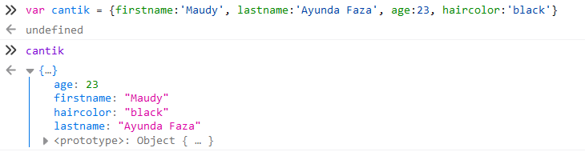
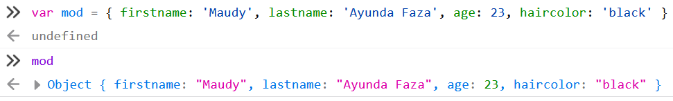
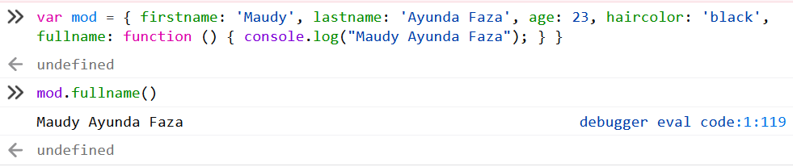
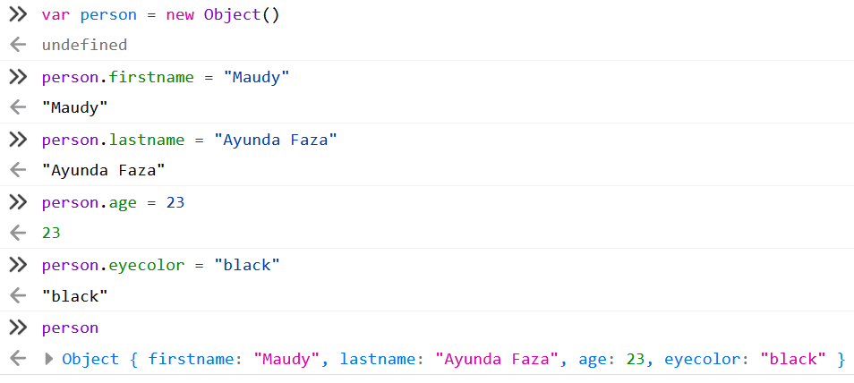
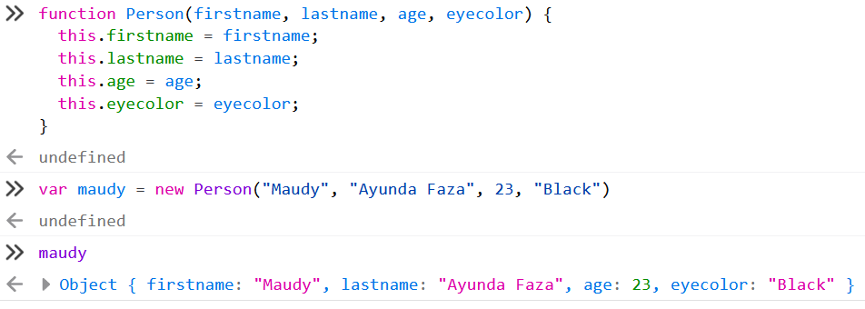
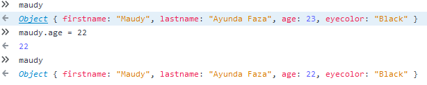
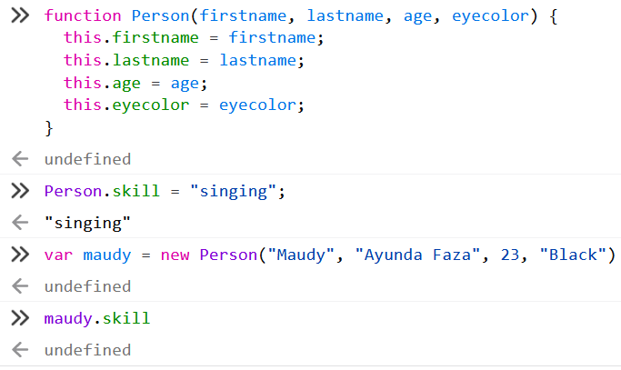

# Belajar Dengan Jenius Node.js

## Penulis : Gun Gun Febrianza

------

# Subchapter 7 - Object

## Learning Objectives

1. Memahami Apa itu Fundamental Object
2. Memahami Apa itu Object Initializer
3. Memahami Apa itu Object Property
4. Memahami Apa itu Object Method
5. Memahami Apa itu Object Constructor
6. Memahami Apa itu Object Prototype
7. Memahami Apa itu Getter & Setter
8. Memahami Apa itu JSON
9. Memahami Date Object


---------------------

Jika pada bab ini anda lupa apa itu definisi object? 

Maka anda harus kembali ke *chapter* sebelumnya tentang ***Reference Types*** agar bisa melanjutkan *chapter* ini dengan baik. Sebelumnya kita telah mempelajari apa itu *object* dalam konteks *data types*, namun sebelum mengeksplorasi pembuatan dan pemanfaatan *object*. 

Tahukah anda definisi *object* benar-benar sangat ambigu dalam *javascript* jika kita amati secara detail.

*Object* yang telah kita pelajari sebelumnya adalah sebuah *Fundamental Object* yang menjadi bagian dari **built-in Object** dalam sebuah *Javascript Engine*.


-------

# Fundamental Object 

**Pada dasarnya segala sesuatu yang ada didalam javascript adalah sebuah object,** namun begitu dalam *javascript* terdapat *fundamental object(s)* yang menjadi dasar *object* semua *objects* yang ada di dalam *javascript*. 

Di antaranya adalah :

1. Object
2. Function
3. Boolean
4. Symbol
5. Error
6. EvalError
7. InternalError
8. RangeError
9. ReferenceError
10. SyntaxError
11. TypeError
12. URIError

Sebelumnya kita telah mempelajari cara membuat **function object** menggunakan *function constructor*. *Function* adalah salah satu dari bagian *fundamental object* yang dimiliki oleh *javascript*.

# Custom Object

**Saya tegaskan sekali lagi pada dasarnya segala sesuatu yang ada didalam javascript adalah sebuah object,** meskipun begitu kita tetap mempunyai kesempatan untuk membuat **custom object** buatan kita sendiri. 


Ada tiga cara membuat *custom object*, menggunakan *Object Initializer, Object Constructor,* dan *function style* : 

## Object Initializer 

**Object Initializer** atau notasi *initializer* adalah cara membuat *object* tanpa menggunakan *constructor*, *object* dibuat dengan gaya **literal** di dalam kurung kurawal (*curly brace*) dan sering kali disebut dengan *object literal*.

Buka **web console** dengan menekan tombol **CTRL+SHIFT+K**, selanjutnya tulis kode di bawah ini :

```javascript
var cantik = {firstname:'Maudy', lastname:'Ayunda Faza', age:23, hairColor:'black'}
```

Jika kita memanggilnya :



### Key & Value

*Object* dapat memiliki sebuah *property* yang memiliki **key & value**, pada kasus di atas *object* memiliki *keys* yaitu  :

1. age
2. firstname
3. haircolor
4. lastname

Setiap *keys* memiliki *values* yaitu :

1. 23
2. "Maudy"
3. "Black"
4. "Ayunda Faza"

*Value* dapat berupa *function*, primitive atau *object* lagi. 

# Object Property 

Pada gambar di bawah ini kita membuat sebuah *object* bernama **mod** dengan *properties* **firstname**, **lastname**, **age** dan **eyecolor**.



# Object Method 

Selain membuat *properties* dalam *object*, kita juga bisa membuat *function* di dalam *object*. 

Di bawah ini kita membuat **function** dengan **identifier fullname** di dalam *object*.



# Object Constructor 

Selain membuat *object* dengan *literal* kita juga bisa membuat *object* dengan memanfaatkan *constructor*. *Keyword* **new** digunakan untuk membuat *constructor*. *Constructor* memiliki ciri menggunakan huruf kapital.



Seperti yang telah kita pelajari sebelumnya pembuatan *object* dengan cara seperti ini tidak disarankan.

# Function Constructor

Untuk membuat **object** lebih ringkas kita bisa melakukanya dengan *function style* atau biasa disebut dengan *function constructor*. Sebelumnya kita membuat *object* dalam satu *statement,* ada cara lain membuat *object* dengan memanfaatkan *function* dan **this** *keyword* :



## Apa itu Mutable?

*Javascript object* bersifat *mutable* artinya *properties* dapat diubah, sebagai contoh pada gambar di bawah ini kita akan mengubah umur maudy.



# Object Prototype 

Sebelumnya kita membuat *object* menggunakan *function style*, namun kita tidak bisa menambahkan *property* yang baru. Hal ini membuat penulisan kode menjadi tidak **expressive**, mari kita buktikan :



Pada gambar di atas kita hendak menambahkan *property* **skill** pada *object constructor* yang dibangun dengan *function style*. Saat kita membuat *instance object* dari **Person** dan akses properti **skill** maka hasilnya **undefined**.

Dari permasalahan tersebut ada masanya kita ingin menambah *properties* atau *methods* pada sebuah *object constructor* atau menambah *properties* atau *methods* pada seluruh *object* yang telah dibuat. *Javascript* memberikan solusi atas permasalahan ini dengan konsep *prototype*.

```javascript
   function Person(firstname, lastname, age, eyecolor) {
      this.firstname = firstname;
      this.lastname = lastname;
      this.age = age;
      this.eyecolor = eyecolor;
    }

    Person.prototype.skill = "singing"; // <-- Prototype

    var maudy = new Person("Maudy", "Ayunda Faza", 23, "Black")
    console.log(maudy.skill); //singing
```

Dalam *javascript*, seluruh *object* akan menerima atau mewarisi (**Inherit**) *methods* dan *properties* dari sebuah **Prototype**.  

# Getter & Setter 

# JSON 

# Date Object

